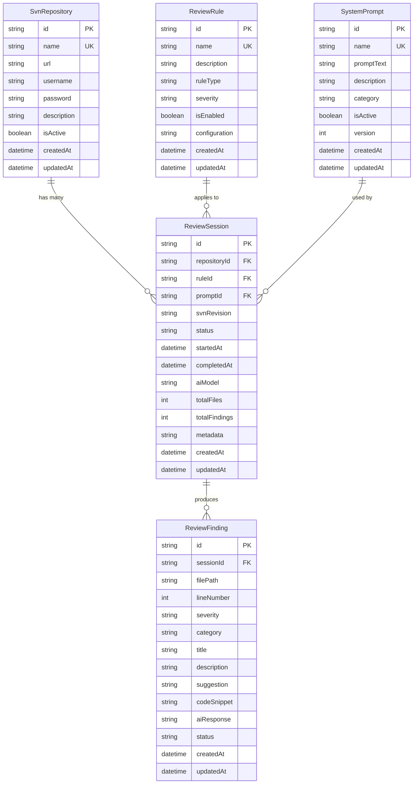

# Database Schema Documentation

## Overview

This document provides detailed technical documentation for the Prisma database schema used in the SVN Code Review System.

## Schema Design Principles

1. **Separation of Concerns**: Configuration (repositories, rules, prompts) is separate from execution data (sessions, findings)
2. **Referential Integrity**: Foreign keys with appropriate cascade behavior maintain data consistency
3. **Flexibility**: JSON fields allow storing complex configuration without schema changes
4. **Audit Trail**: All models include `createdAt` and `updatedAt` timestamps
5. **Performance**: Strategic indexes on frequently queried fields

## Entity Relationships



## Model Details

### SvnRepository

**Purpose**: Central configuration for SVN repositories to be reviewed.

**Unique Constraints**:
- `name`: Each repository must have a unique name

**Indexes**:
- `name`: For fast lookups by name
- `isActive`: For filtering active/inactive repositories

**Cascade Behavior**:
- **ON DELETE CASCADE**: Deleting a repository removes all its review sessions

**Use Cases**:
- List all configured repositories
- Find active repositories for scheduled reviews
- Track repository-specific review history

**Example Query**:
```typescript
// Get all active repositories with their review count
const repos = await prisma.svnRepository.findMany({
  where: { isActive: true },
  include: {
    reviewSessions: {
      select: { id: true }
    }
  }
});
```

---

### ReviewRule

**Purpose**: Define reusable review criteria and patterns.

**Unique Constraints**:
- `name`: Each rule must have a unique name

**Indexes**:
- `name`: For fast lookups by name
- `ruleType`: For filtering rules by category
- `isEnabled`: For filtering active rules

**Enum-like Fields**:
- `ruleType`: "security", "performance", "style", "best-practice", etc.
- `severity`: "low", "medium", "high", "critical"

**Configuration Field**:
The `configuration` field stores JSON for rule-specific settings:
```json
{
  "patterns": ["regex1", "regex2"],
  "excludePatterns": ["safe_pattern"],
  "threshold": 10,
  "checkNestedLoops": true
}
```

**Cascade Behavior**:
- **ON DELETE SET NULL**: If rule is deleted, sessions retain other data but lose the rule reference

**Use Cases**:
- Select appropriate rules for a review session
- Enable/disable rules without deleting them
- Configure rule behavior without code changes

**Example Query**:
```typescript
// Get all enabled security rules
const securityRules = await prisma.reviewRule.findMany({
  where: { 
    ruleType: 'security',
    isEnabled: true 
  },
  orderBy: { severity: 'desc' }
});
```

---

### SystemPrompt

**Purpose**: Store AI prompt templates for different review types.

**Unique Constraints**:
- `name`: Each prompt must have a unique name

**Indexes**:
- `name`: For fast lookups by name
- `category`: For filtering prompts by type
- `isActive`: For filtering active prompts

**Versioning**:
The `version` field enables prompt evolution tracking:
- Increment version when making significant changes
- Keep old versions for reproducibility

**Cascade Behavior**:
- **ON DELETE SET NULL**: If prompt is deleted, sessions retain other data but lose the prompt reference

**Use Cases**:
- Select appropriate prompt for review focus
- A/B test different prompts
- Track which prompts produce best results

**Example Query**:
```typescript
// Get latest version of active security prompt
const prompt = await prisma.systemPrompt.findFirst({
  where: { 
    category: 'security',
    isActive: true 
  },
  orderBy: { version: 'desc' }
});
```

---

### ReviewSession

**Purpose**: Track individual review executions with their context.

**Indexes**:
- `repositoryId`: For finding all sessions for a repository
- `status`: For filtering sessions by state
- `startedAt`: For chronological queries

**Status Flow**:
```
pending → in-progress → completed
                     ↘ failed
```

**Foreign Keys**:
- `repositoryId` (Required): Which repository was reviewed
- `ruleId` (Optional): Which rule was applied
- `promptId` (Optional): Which prompt was used

**Metadata Field**:
The `metadata` field stores additional session information as JSON:
```json
{
  "scanDuration": "5m30s",
  "filesScanned": ["file1.js", "file2.js"],
  "errors": [],
  "aiModelVersion": "gpt-4-turbo",
  "tokenUsage": 5000
}
```

**Cascade Behavior**:
- **ON DELETE CASCADE** from `SvnRepository`: Deleting a repo removes all its sessions
- **ON DELETE CASCADE** to `ReviewFinding`: Deleting a session removes all its findings
- **ON DELETE SET NULL** from `ReviewRule` and `SystemPrompt`

**Use Cases**:
- Monitor review execution status
- Analyze review performance metrics
- Audit review history

**Example Query**:
```typescript
// Get recent completed sessions with findings
const sessions = await prisma.reviewSession.findMany({
  where: { status: 'completed' },
  include: {
    repository: true,
    findings: {
      where: { severity: 'critical' }
    }
  },
  orderBy: { startedAt: 'desc' },
  take: 10
});
```

---

### ReviewFinding

**Purpose**: Store individual issues discovered during reviews.

**Indexes**:
- `sessionId`: For finding all findings in a session
- `severity`: For filtering by importance
- `category`: For filtering by issue type
- `status`: For tracking resolution
- `filePath`: For finding all issues in a file

**Status Flow**:
```
open → acknowledged → resolved
    ↘ ignored
```

**Severity Levels**:
- `critical`: Security vulnerabilities, data loss risks
- `high`: Performance issues, major bugs
- `medium`: Code quality, minor bugs
- `low`: Style issues, suggestions

**Cascade Behavior**:
- **ON DELETE CASCADE** from `ReviewSession`: Deleting a session removes all its findings

**Use Cases**:
- Generate review reports
- Track issue resolution
- Identify recurring problems
- Measure code quality trends

**Example Query**:
```typescript
// Get unresolved critical findings across all sessions
const criticalIssues = await prisma.reviewFinding.findMany({
  where: {
    severity: 'critical',
    status: 'open'
  },
  include: {
    session: {
      include: { repository: true }
    }
  },
  orderBy: { createdAt: 'desc' }
});
```

## Common Query Patterns

### Get Repository Review Summary
```typescript
const summary = await prisma.svnRepository.findUnique({
  where: { name: 'main-project' },
  include: {
    reviewSessions: {
      include: {
        findings: {
          select: {
            severity: true,
            status: true
          }
        }
      }
    }
  }
});
```

### Get Recent High-Severity Findings
```typescript
const recentIssues = await prisma.reviewFinding.findMany({
  where: {
    severity: { in: ['high', 'critical'] },
    createdAt: {
      gte: new Date(Date.now() - 7 * 24 * 60 * 60 * 1000) // Last 7 days
    }
  },
  include: {
    session: {
      include: { repository: true }
    }
  }
});
```

### Track Rule Effectiveness
```typescript
const ruleStats = await prisma.reviewRule.findMany({
  include: {
    reviewSessions: {
      include: {
        findings: {
          select: { severity: true }
        }
      }
    }
  }
});
```

## Performance Considerations

### Query Optimization
1. **Use `select` instead of `include`** when you don't need all fields
2. **Paginate large result sets** using `take` and `skip`
3. **Add indexes** for frequently filtered/sorted fields
4. **Use `findUnique` instead of `findFirst`** when possible

### Index Strategy
Current indexes support:
- Fast repository lookups by name
- Filtering active repositories/rules/prompts
- Session status queries
- Finding severity/category/status filtering
- File path lookups

### Potential Additional Indexes
For high-volume deployments, consider:
```prisma
@@index([repositoryId, startedAt])     // ReviewSession
@@index([sessionId, severity])          // ReviewFinding
@@index([status, updatedAt])            // ReviewFinding
```

## Data Integrity Rules

### Required Relationships
- `ReviewSession` MUST have a `repositoryId`
- `ReviewFinding` MUST have a `sessionId`

### Optional Relationships
- `ReviewSession` MAY have `ruleId` and `promptId` (allows flexibility)

### Cascade Rules Summary
| Parent | Child | Delete Behavior |
|--------|-------|----------------|
| SvnRepository | ReviewSession | CASCADE |
| ReviewSession | ReviewFinding | CASCADE |
| ReviewRule | ReviewSession | SET NULL |
| SystemPrompt | ReviewSession | SET NULL |

## Migration Best Practices

### Creating Migrations
```bash
# Development
npx prisma migrate dev --name descriptive_name

# Production
npx prisma migrate deploy
```

### Adding Fields
1. Add optional field first (nullable)
2. Backfill data if needed
3. Make required in subsequent migration if necessary

### Removing Fields
1. Mark as optional first
2. Update application code
3. Remove field in subsequent migration

### Changing Relationships
1. Add new relationship as optional
2. Migrate data
3. Make required and remove old relationship

## Security Considerations

### Sensitive Data
- **SVN Passwords**: Should be encrypted at rest (application-level encryption)
- **AI Responses**: May contain code snippets - consider data retention policies

### Access Control
Implement application-level access control for:
- Repository credentials
- Review session data
- Finding details

### Audit Trail
All models include `createdAt` and `updatedAt` for basic audit tracking. Consider adding:
- User tracking (who created/modified records)
- Change history (log previous values)

## Testing Data

### Seed Data Structure
The seed script creates:
- 2 repositories (1 active, 1 inactive)
- 3 rules (security, performance, style)
- 3 prompts (general, security, performance)
- 1 completed session with 3 findings

### Running Seeds
```bash
npm run prisma:seed
```

### Clearing Data
```bash
# Reset database (delete and recreate)
npx prisma migrate reset
```

## Troubleshooting

### Common Issues

**Issue**: Migration fails with foreign key constraint
- **Solution**: Check cascade behavior and data integrity

**Issue**: Query performance degradation
- **Solution**: Add indexes, use `EXPLAIN QUERY PLAN` to analyze

**Issue**: Generated client not found
- **Solution**: Run `npx prisma generate`

### Useful Commands
```bash
# View database in browser
npx prisma studio

# Format schema
npx prisma format

# Validate schema
npx prisma validate

# View migration status
npx prisma migrate status
```

## Future Enhancements

Potential schema extensions:
1. **User Management**: Add user/team models for multi-user scenarios
2. **Notifications**: Add notification preferences and delivery tracking
3. **Webhooks**: Track webhook configurations and delivery logs
4. **Custom Fields**: Allow users to add custom metadata to entities
5. **Review Templates**: Pre-configured combinations of rules and prompts
6. **Scheduled Reviews**: Store cron-like schedules for automated reviews
